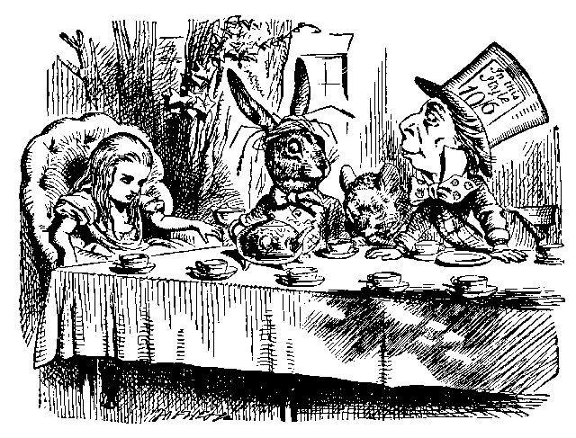

# The March Hare

Hare is a simple HTTP server that turns [Hatter] templates into
HTML on-the-fly. It can be used for prototyping or developing static
sites quickly, with no compilation necessary.

Just start `hare` by pointing it at a directory of `*.hat` files, as
well as any static assets you're using (like `*.gif`), and have at!

[hatter]: https://github.com/xvxx/hatter
